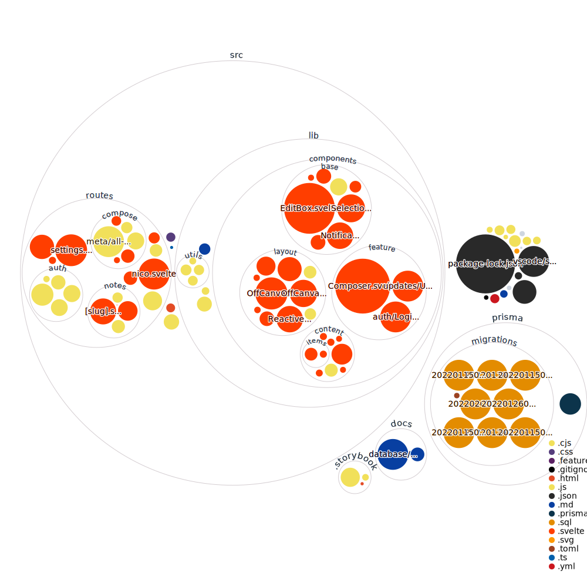

# Untitled Projects.

## How to run

- Have your `.env` set up (reach out to @yych42 if you are on the team).
- Run normally with `npm run dev -- --open`

## White Label Environmental Variables

Although the site is completely customizable, it is going to be implemented in a way that allows the modification to be done through environmental variables. The cool thing about this is that if you do not wish to modify the default value or forgot any, we have a wrapper environment.js file to "intelligently" handle missing values and implement the default.

The format conversion is as follows: `.env` VITE_SITE_TITLE => `environment.js` site_title

Currently supported variables:

- [x] VITE_SITE_TITLE: Default("Untitled Projects")

## Visualization of the Codebase

